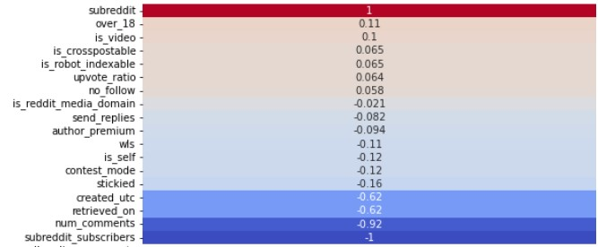
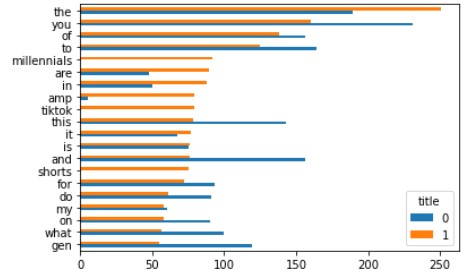
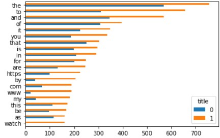
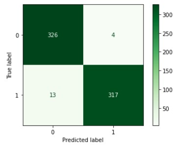
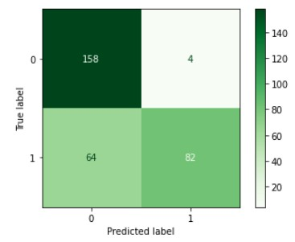

# Project 3: Web APIs & NLPS
## by: Matthew Edelmann

### Overview

This is an overview of my project. 

### Problem Statement

I want to compare 2 different subreddits. 1 was the GenZ subredddit and the other was the millenial subreddit. 

### Datasets

We used 2 data sets. They came from scrapping the 2 subreddits. We did this by using the requests.get() function. We scrapped 1000 posts from each subreddits respectively.

### Deliverables

The first thing we looked at was a numeric heatmap. We wanted to see if any numerical entries in the subreddit could predict which subreddit it belonged to. Here is what we found:
 
 
 We can see that the higher the number of comments are, the more likely the it is to be on the GenZ subreddit. 
 
 After that, we checked the classification data. We checked with both the title and the selftext. We'll will show 3 analytic techniques for both the title and selftext. The first is how common each word is:
 Title:
  
  
  We see the words milennial(s), tiktok, shorts and amp favor the milennial subreddit and gen favors the GenZ subreddit.
  
  Selftext:
  
  
  We see in the subtext that the words https, com, www, and watch are all more correlated with millenial than with GenZ. This indicates to me that people in the millenial subreddit are more likely to post links than in the GenZ subreddit.
  
  Now we will look at the confession matrix for both. We created this using TfidfVectorizer() and ('nb', MultinomialNB()) in our pipeline:
  
  Title:
  
  
  It seems that out of 660 testing data, the model only predicted 17 entries incorrectly. Here are it's train and r^2 score:
  
  Train: 0.9828358208955223
  Test: 0.9742424242424242
  
  This indicates that out model is 97.4% accurate in predicting whether a title is in the millenial subreddit or the GenZ one.
  
  Selftext:
  
  
  This shows most of the problem comes when the model predicts for the GenZ subreddit and it is really in the millenial subreddit. Here are it's train and r^2 score:
  
  Train: 0.8057784911717496
  Test: 0.7792207792207793

  This shows that the model is 77.9% accurate in predicting the subreddit given subtext. It is slightly overfit. 
  
  Finally we look at the Random Forest and Extra Trees Classification models. The cross-validation score was the same for both Random Forest and Extra Trees but differ in title and selftext:
  
  Title: 0.9858208955223879
  Selftext: 0.8089548387096773 
  
  This shows that they give a 98.6% accuracy when predicting the title and a 81% accuracy when predicting the selftext.
  
### Conclusion

Given a title, it is easy to create a model that can determine if the title is from the millenial subreddit or the GenZ subreddit. If given selftext, I recommend either the RandomForestClassifier or the ExtraTreesClassifier.
  
  
  
  
